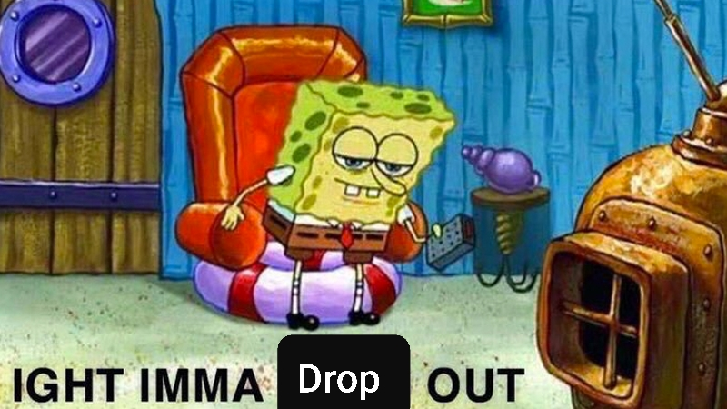

# **User Page**

### Navigation
- [**User Page**](#user-page)
    - [Navigation](#navigation)
  - [About Me](#about-me)
    - [Education](#education)
    - [Favorite Quote](#favorite-quote)
    - [Bucket List](#bucket-list)
    - [Favorite Music](#favorite-music)
    - [Favorite Piece of Text](#favorite-piece-of-text)
    - [As a Programmer](#as-a-programmer)
    - [Favorite Meme](#favorite-meme)

## About Me
### Education
- Lincoln Elementary School
- Magruder Middle School
- North High School
- UCSD

### Favorite Quote
> *"You have to be able to accept failure to get better"* - Lebron James

### Bucket List
- [x] Travel out of State
- [x] Travel out of Country
- [ ] Watch The Lord of the Rings 
- [ ] Eat fancy food
  
### Favorite Music
- [Inspirational Music](https://www.youtube.com/watch?v=dQw4w9WgXcQ&ab_channel=RickAstleyVEVO)
- [Study Music](https://www.youtube.com/watch?v=3jWRrafhO7M&ab_channel=CafeMusicBGMchannel)

### Favorite Piece of Text
[Bee Movie Script](./Files/Story1.txt)

### As a Programmer
I came into college without any real knowledge of how to code. The languages I am most familar with is Python and Java. I like to do my conditionals like this:
```
if(Condition) {
    Statements
    /*
    ...
    */
}

```

### Favorite Meme


